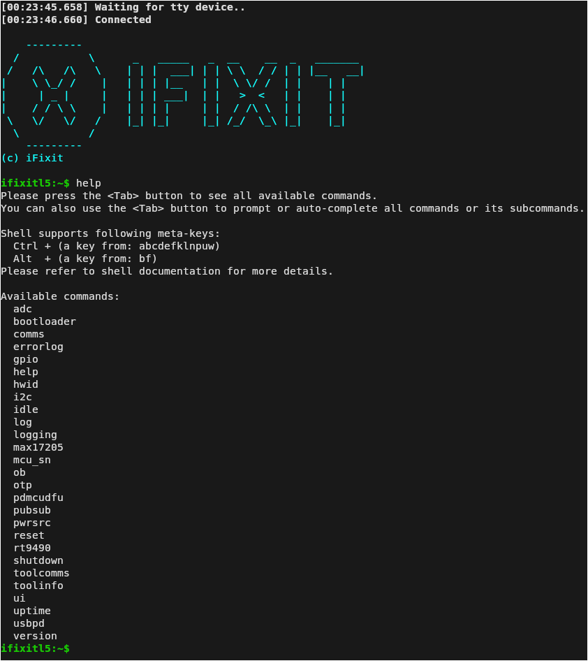
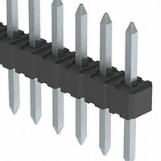
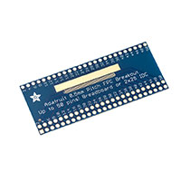
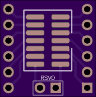
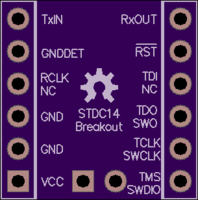

# FixHub Reverse Engineering

Dumping and (possibly) reversing the firmware on the iFixit FixHub soldering iron. The MCU is an STM32G491KCU6 (Cortex-M4). SWD is broken out on a 10-pin header on the board.

---

## The Setup


The STLINK-V3MINIE connects to the board through a STDC14-to-SWD adapter PCB. The adapter has the Samtec FTSH-107 header on one end (mates with the STLINK) and breaks out to a 10-pin 1.27mm ribbon cable on the other end. That ribbon plugs into J2 on the FixHub board. The iron has to be powered via USB-C while doing this — don't try to power it from the STLINK 3.3V pin, the board has its own regulators.

**Pin connections (J2 on FixHub → STLINK):**

| J2 | Signal | STLINK |
|----|--------|--------|
| 1 | SWDIO | SWDIO |
| 2 | GND | GND |
| 3 | SWCLK | SWCLK |
| 4 | GND | GND |
| 9 | NRST | NRST |

Hook up NRST — the firmware reconfigures the SWD pins early in boot and you'll lose the connection if you don't connect under reset.

---

## Dumping the Firmware

```bash
# install tools
sudo pacman -S stlink openocd

# verify the probe sees the chip
st-info --probe

# dump 256 KB of flash
st-flash read fixhub_full.bin 0x08000000 0x40000
```

If it won't connect, the app is winning the race to reconfigure SWD. Hold NRST low with a jumper, run the command, then release. Or use OpenOCD:

```bash
openocd -f interface/stlink.cfg -f target/stm32g4x.cfg \
        -c "reset_config srst_only connect_assert_srst"
```

Then in a second terminal:

```
telnet localhost 4444
reset halt
flash read_bank 0 fixhub_full.bin
shutdown
```

Chip is RDP Level 0 (no read protection) so the dump just works once you're connected.

---

## The CLI

The iron exposes a full serial shell over USB:



Commands: `adc`, `bootloader`, `comms`, `errorlog`, `gpio`, `hwid`, `i2c`, `idle`, `log`, `logging`, `max17205`, `mcu_sn`, `ob`, `otp`, `pdmcudfu`, `pubsub`, `pwrsrc`, `reset`, `rt9490`, `shutdown`, `toolcomms`, `toolinfo`, `ui`, `uptime`, `usbpd`, `version`

`ob` = option bytes, `otp` = one-time programmable memory, `pdmcudfu` = PD MCU DFU (firmware update path for the USB-PD controller), `max17205` and `rt9490` are the fuel gauge and charger ICs talking directly. 

---

## Parts

| | Part | Link |
|---|---|---|
| [.webp)](https://www.digikey.com/en/products/detail/stmicroelectronics/STLINK-V3MINIE/16284301) | STLINK-V3MINIE | [Digi-Key](https://www.digikey.com/en/products/detail/stmicroelectronics/STLINK-V3MINIE/16284301) |
| [.webp)](https://www.digikey.com/en/products/detail/samtec-inc/FTSH-107-01-L-DV-K/6678186) | Samtec FTSH-107-01-L-DV-K | [Digi-Key](https://www.digikey.com/en/products/detail/samtec-inc/FTSH-107-01-L-DV-K/6678186) |
| [.webp)](https://www.digikey.com/en/products/detail/molex/0150200105/3043329) | Molex 0150200105 | [Digi-Key](https://www.digikey.com/en/products/detail/molex/0150200105/3043329) |
| [.webp)](https://www.digikey.com/en/products/detail/molex/5034801000/2356624) | Molex 5034801000 | [Digi-Key](https://www.digikey.com/en/products/detail/molex/5034801000/2356624) |
| [](https://www.digikey.com/en/products/detail/molex/0022284360/313821) | Molex 0022284360 | [Digi-Key](https://www.digikey.com/en/products/detail/molex/0022284360/313821) |
| [](https://www.digikey.com/en/products/detail/adafruit-industries-llc/1492/5154671) | Adafruit 1492 | [Digi-Key](https://www.digikey.com/en/products/detail/adafruit-industries-llc/1492/5154671) |

**Adapter PCB** (STDC14 → 10-pin SWD) from [OSH Park](https://oshpark.com/shared_projects?search%5Bquery%5D=stdc14&button=&search%5Bfilters%5D%5Bpcb_layers%5D%5Btwo_layer%5D=1&search%5Bfilters%5D%5Bpcb_layers%5D%5Bfour_layer%5D=1&search%5Bfilters%5D%5Bpcb_layers%5D%5Bsix_layer%5D=1&records_date_sort=desc&records_per_page=20):

| Top | Bottom |
|-----|--------|
|  |  |

---

## Docs

- [Hardware / Schematic](docs/hardware.md)
- [Firmware Dump Procedure](docs/firmware-dump.md)
- [Binary Analysis](docs/binary-analysis.md)
- [Exception Vector Table](docs/vector-table.md)
- [Ghidra Setup & Findings](docs/ghidra-analysis.md)
